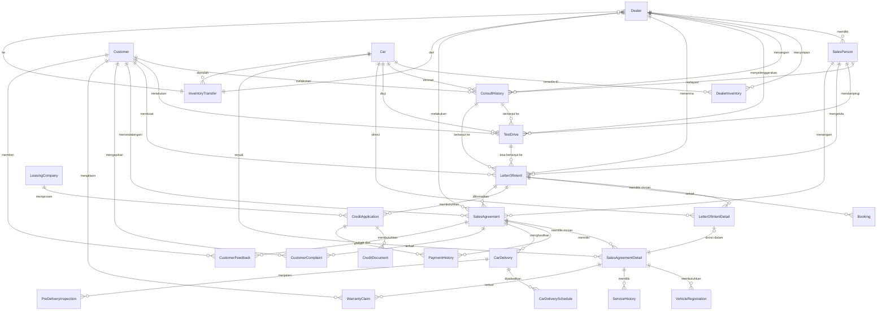

# Dokumentasi Awal: Business Process Modeling AutoCar Dealership

## 1. Pendahuluan

Dokumentasi ini memetakan proses bisnis penjualan mobil di AutoCar Dealership ke dalam entitas dan tabel database, sebagai dasar desain sistem informasi yang mendukung berbagai dealer AutoCar.

## 2. Pemetaan Proses Bisnis ke Entitas/Tabel

| Proses Bisnis                | Entitas/Tabel Utama         | Makna/Deskripsi Singkat                                                                 |
|------------------------------|-----------------------------|----------------------------------------------------------------------------------------|
| Konsultasi Awal              | ConsultHistory, Dealer, Customer, SalesPerson, Car | Data konsultasi awal, dealer, pelanggan, petugas penjualan, dan mobil yang diminati |
| Test Drive                   | TestDrive                   | Catatan test drive                                                                      |
| Kesepakatan & Booking Fee    | Booking, LetterOfIntent, LetterOfIntentDetail | Pencatatan booking fee, dokumen LOI (header), dan detail unit mobil di LOI             |
| Proses Kredit                | CreditApplication, LeasingCompany, CreditDocument | Pengajuan kredit, data leasing, dan dokumen pendukung                          |
| Pembayaran & Administrasi    | PaymentHistory, VehicleRegistration, SalesAgreement, SalesAgreementDetail | Pembayaran DP/lunas, administrasi, transaksi penjualan, dan detail mobil yang dibeli   |
| Serah Terima Mobil           | CarDelivery, PreDeliveryInspection, SalesAgreement, SalesAgreementDetail, CarDeliverySchedule | Proses PDI, serah terima mobil, penjadwalan pengiriman, transaksi, dan detail mobil    |
| Pasca-Penjualan              | ServiceHistory, CustomerComplaint, WarrantyClaim, CustomerFeedback, SalesAgreement | Layanan follow-up servis pertama, penanganan keluhan, klaim garansi, feedback pelanggan, dan transaksi |
| Manajemen Stok & Mutasi      | DealerInventory, InventoryTransfer, Dealer, Car | Pengelolaan stok mobil dan mutasi antar dealer                                          |

## 3. Makna Setiap Entitas/Tabel

| No. | Tabel                  | Makna/Deskripsi                                                                 |
|-----|------------------------|---------------------------------------------------------------------------------|
| 1   | LetterOfIntent         | Header dokumen LOI, berisi info umum pemesanan dan pelanggan.                   |
| 2   | LetterOfIntentDetail   | Rincian unit mobil yang dipesan dalam satu LOI.                                 |
| 3   | SalesAgreement         | Catatan transaksi penjualan yang dibuat setelah pembayaran dan administrasi selesai. |
| 4   | SalesAgreementDetail   | Rincian unit mobil yang dibeli dalam satu transaksi.                              |
| 5   | ConsultHistory         | Catatan konsultasi awal: kebutuhan, preferensi, tanggal, dan hasil diskusi.     |
| 6   | Dealer                 | Data dealer AutoCar, lokasi, dan identitas dealer.                              |
| 7   | Customer               | Menyimpan data pelanggan yang melakukan pembelian mobil.                        |
| 8   | SalesPerson            | Data petugas penjualan yang menangani pelanggan.                                |
| 9   | Car                    | Data mobil yang tersedia untuk dijual di setiap dealer.                         |
| 10  | TestDrive              | Catatan aktivitas test drive oleh pelanggan.                                    |
| 11  | Booking                | Data pembayaran booking fee dan status booking.                                 |
| 12  | CreditApplication      | Data pengajuan kredit oleh pelanggan.                                           |
| 13  | LeasingCompany         | Data perusahaan leasing yang bekerja sama.                                      |
| 14  | CreditDocument         | Dokumen pendukung pengajuan kredit (KTP, slip gaji, dll).                       |
| 15  | PaymentHistory         | Catatan pembayaran DP, pelunasan, atau cicilan kredit.                          |
| 16  | VehicleRegistration    | Proses administrasi STNK, BPKB, pajak, asuransi.                                |
| 17  | CarDelivery            | Proses serah terima mobil ke pelanggan.                                         |
| 18  | CarDeliverySchedule    | Penjadwalan pengiriman kendaraan ke pelanggan.                                  |
| 19  | PreDeliveryInspection  | Catatan Pre-Delivery Inspection (PDI) oleh teknisi.                             |
| 20  | ServiceHistory         | Layanan purna jual, seperti follow-up servis pertama.                           |
| 21  | CustomerComplaint      | Catatan keluhan pelanggan terkait produk atau layanan.                          |
| 22  | WarrantyClaim          | Klaim garansi kendaraan oleh pelanggan.                                         |
| 23 | DealerInventory        | Data stok mobil di setiap dealer, termasuk harga jual, persentase diskon dan fee default per dealer-mobil. Kolom DiscountPercent dan FeePercent bersifat NOT NULL dengan nilai default 0 sesuai implementasi. Kombinasi (DealerID, CarID) bersifat unik (UNIQUE constraint) untuk mencegah duplikasi entri stok per dealer-mobil. |
| 24  | InventoryTransfer      | Catatan mutasi (perpindahan) stok antar dealer.                                 |
| 25  | CustomerFeedback       | Feedback atau survey kepuasan pelanggan setelah transaksi.                      |

## 4. Relasi Antar Entitas/Tabel

| Relasi                        | Tabel Sumber         | Tabel Tujuan         | Kardinalitas & Makna                                                                 |
|-------------------------------|----------------------|----------------------|--------------------------------------------------------------------------------------|
| Dealer memiliki banyak        | SalesPerson          | Dealer               | Satu dealer punya banyak sales person                                                |
| Dealer memiliki banyak        | DealerInventory      | Dealer               | Satu dealer punya banyak stok mobil                                                  |
| Dealer memiliki banyak        | ConsultHistory       | Dealer               | Satu dealer menangani banyak konsultasi                                              |
| Customer melakukan banyak     | ConsultHistory       | Customer             | Satu customer bisa melakukan banyak konsultasi                                       |
| Customer melakukan banyak     | LetterOfIntent       | Customer             | Satu customer bisa membuat banyak LOI                                                |
| LetterOfIntent memiliki banyak| LetterOfIntentDetail | LetterOfIntent       | Satu LOI bisa berisi banyak mobil                                                    |
| SalesAgreement memiliki banyak| SalesAgreementDetail | SalesAgreement       | Satu transaksi bisa berisi banyak mobil                                              |
| LetterOfIntent terkait        | Booking              | LetterOfIntent       | Satu LOI bisa punya satu/many booking                                                |
| CreditApplication terkait     | LeasingCompany       | CreditApplication    | Satu pengajuan kredit bisa terkait dengan satu perusahaan leasing                    |
| LetterOfIntent terkait        | CreditApplication    | LetterOfIntent       | Satu LOI bisa punya satu/many pengajuan kredit                                       |
| SalesAgreement terkait        | PaymentHistory       | SalesAgreement       | Satu transaksi bisa punya banyak pembayaran                                          |
| CreditApplication terkait     | PaymentHistory       | CreditApplication    | Satu pengajuan kredit bisa punya banyak pembayaran cicilan                           |
| SalesAgreement terkait        | CarDelivery          | SalesAgreement       | Satu transaksi bisa punya satu/many pengiriman                                       |
| CarDelivery terkait           | CarDeliverySchedule  | CarDelivery          | Satu pengiriman bisa punya satu jadwal                                               |
| Customer terkait              | CustomerComplaint    | Customer             | Satu customer bisa punya banyak keluhan                                              |
| Customer terkait              | WarrantyClaim        | Customer             | Satu customer bisa punya banyak klaim garansi                                        |
| Customer terkait              | CustomerFeedback     | Customer             | Satu customer bisa punya banyak feedback                                             |
| Car terkait                   | DealerInventory      | Car                  | Satu mobil bisa ada di banyak stok dealer                                            |
| InventoryTransfer terkait     | Dealer, DealerInventory| InventoryTransfer    | Mutasi stok antar dealer dan inventory                                               |
| SalesAgreementDetail terkait  | LetterOfIntentDetail | SalesAgreementDetail | Satu detail transaksi bisa terkait dengan satu detail LOI                            |

## 5. Diagram Relasi (ERD) - Ringkas



## 6. Desain Kolom Tabel Utama

### 1. Tabel: LetterOfIntent (Header)
| Nama Kolom       | Tipe Data      | Keterangan                               |
|------------------|----------------|------------------------------------------|
| LOIID            | INT, PK        | ID unik untuk setiap LOI                 |
| DealerID         | INT, FK        | ID dealer tempat LOI dibuat (Wajib diisi) |
| CustomerID       | INT, FK        | ID pelanggan yang membuat LOI (Wajib diisi) |
| SalesPersonID    | INT, FK        | ID sales person yang menangani (Wajib diisi) |
| ConsultHistoryID | INT, FK        | ID konsultasi terkait (opsional)         |
| TestDriveID      | INT, FK        | ID test drive terkait (opsional)         |
| LOIDate          | DATETIME       | Tanggal LOI dibuat (Wajib diisi)         |
| PaymentMethod    | VARCHAR(20)    | Metode pembayaran yang disepakati       |
| Note             | VARCHAR(200)   | Catatan umum untuk LOI                   |

### 2. Tabel: LetterOfIntentDetail
| Nama Kolom      | Tipe Data      | Keterangan                               |
|-----------------|----------------|------------------------------------------|
| LOIDetailID     | INT, PK        | ID unik untuk setiap detail LOI          |
| LOIID           | INT, FK        | ID LOI header (Wajib diisi)              |
| CarID           | INT, FK        | ID mobil yang dipesan (Wajib diisi)      |
| AgreedPrice     | MONEY          | Harga final mobil (Wajib diisi)          |
| Discount        | MONEY          | Diskon yang diberikan (opsional)         |
| DownPayment     | MONEY          | Uang muka yang dibayar (opsional)        |
| Note            | VARCHAR(200)   | Catatan spesifik untuk unit mobil ini    |

### 3. Tabel: SalesAgreement (Header)
| Nama Kolom        | Tipe Data      | Keterangan                               |
|-------------------|----------------|------------------------------------------|
| SalesAgreementID  | INT, PK        | ID unik untuk setiap transaksi           |
| DealerID          | INT, FK        | ID dealer tempat transaksi terjadi (Wajib diisi) |
| CustomerID        | INT, FK        | ID pelanggan yang bertransaksi (Wajib diisi) |
| SalesPersonID     | INT, FK        | ID sales person yang menangani (Wajib diisi) |
| LOIID             | INT, FK        | ID LOI terkait (opsional)                |
| TransactionDate   | DATETIME       | Tanggal transaksi (Wajib diisi)          |
| TotalAmount       | MONEY          | Total nilai transaksi                    |
| Status            | VARCHAR(20)    | Status transaksi (e.g., Completed, Unpaid)    |

### 4. Tabel: SalesAgreementDetail
| Nama Kolom             | Tipe Data      | Keterangan                               |
|------------------------|----------------|------------------------------------------|
| SalesAgreementDetailID | INT, PK        | ID unik untuk setiap detail transaksi    |
| SalesAgreementID       | INT, FK        | ID transaksi header (Wajib diisi)        |
| LOIDetailID            | INT, FK        | ID detail LOI terkait (opsional)         |
| CarID                  | INT, FK        | ID mobil yang dibeli (Wajib diisi)       |
| Price                  | MONEY          | Harga mobil saat transaksi (Wajib diisi) |
| Discount               | MONEY          | Diskon yang diberikan (opsional)         |
| Note                   | VARCHAR(200)   | Catatan spesifik untuk unit mobil ini    |

### 5. Tabel: ConsultHistory
| Nama Kolom         | Tipe Data      | Keterangan                               |
|--------------------|----------------|------------------------------------------|
| ConsultHistoryID   | INT, PK        | ID unik untuk setiap konsultasi          |
| DealerID           | INT, FK        | ID dealer tempat konsultasi (Wajib diisi) |
| CustomerID         | INT, FK        | ID pelanggan yang berkonsultasi (Wajib diisi) |
| SalesPersonID      | INT, FK        | ID sales person yang melayani (Wajib diisi) |
| CarID              | INT, FK        | ID mobil yang diminati (opsional)        |
| Budget             | MONEY          | Anggaran pelanggan (opsional)            |
| PaymentMethod      | VARCHAR(20)    | Metode pembayaran yang direncanakan     |
| ConsultationDate   | DATETIME       | Tanggal konsultasi (Wajib diisi)         |
| Note               | VARCHAR(200)   | Catatan dari konsultasi                  |

### 6. Tabel: Dealer
| Nama Kolom    | Tipe Data      | Keterangan                               |
|---------------|----------------|------------------------------------------|
| DealerID      | INT, PK        | ID unik untuk setiap dealer              |
| Name          | VARCHAR(100)   | Nama dealer (Wajib diisi)                |
| City          | VARCHAR(50)    | Kota lokasi dealer (Wajib diisi)         |
| Address       | VARCHAR(200)   | Alamat lengkap dealer                    |
| PhoneNumber   | VARCHAR(20)    | Nomor telepon dealer (Format divalidasi) |

### 7. Tabel: Customer
| Nama Kolom    | Tipe Data      | Keterangan                               |
|---------------|----------------|------------------------------------------|
| CustomerID    | INT, PK        | ID unik untuk setiap pelanggan           |
| Name          | VARCHAR(100)   | Nama lengkap pelanggan (Wajib diisi)     |
| PhoneNumber   | VARCHAR(20)    | Nomor telepon pelanggan                  |
| Email         | VARCHAR(100)   | Alamat email pelanggan   (UNIQUE)        |
| Address       | VARCHAR(200)   | Alamat lengkap pelanggan                 |

### 8. Tabel: SalesPerson
| Nama Kolom      | Tipe Data      | Keterangan                               |
|-----------------|----------------|------------------------------------------|
| SalesPersonID   | INT, PK        | ID unik untuk setiap sales person        |
| DealerID        | INT, FK        | ID dealer tempat sales person bekerja (Wajib diisi) |
| Name            | VARCHAR(100)   | Nama lengkap sales person (Wajib diisi)  |

### 9. Tabel: Car
| Nama Kolom  | Tipe Data      | Keterangan                               |
|-------------|----------------|------------------------------------------|
| CarID       | INT, PK        | ID unik untuk setiap mobil               |
| Model       | VARCHAR(100)   | Nama/model mobil (e.g., Mitsu Pajero) (Wajib diisi) |
| CarType     | VARCHAR(50)    | Tipe mobil (e.g., SUV, MPV) (Wajib diisi) |
| BasePrice   | MONEY          | Harga dasar mobil (Wajib diisi)          |
| Year        | INT            | Tahun pembuatan mobil                    |
| Color       | VARCHAR(30)    | Warna mobil                              |

### 10. Tabel: TestDrive
| Nama Kolom         | Tipe Data      | Keterangan                               |
|--------------------|----------------|------------------------------------------|
| TestDriveID        | INT, PK        | ID unik untuk setiap test drive          |
| DealerID           | INT, FK        | ID dealer tempat test drive (Wajib diisi) |
| CustomerID         | INT, FK        | ID pelanggan yang melakukan test drive (Wajib diisi) |
| SalesPersonID      | INT, FK        | ID sales person yang mendampingi (Wajib diisi) |
| CarID              | INT, FK        | ID mobil yang di-test drive (Wajib diisi) |
| ConsultHistoryID   | INT, FK        | ID konsultasi terkait (opsional)         |
| TestDriveDate      | DATETIME       | Tanggal test drive (Wajib diisi)         |
| Note               | VARCHAR(200)   | Catatan dari test drive                  |

### 11. Tabel: Booking
| Nama Kolom    | Tipe Data      | Keterangan                               |
|---------------|----------------|------------------------------------------|
| BookingID     | INT, PK        | ID unik untuk setiap booking             |
| LOIID         | INT, FK        | ID LOI terkait (Wajib diisi)             |
| BookingFee    | MONEY          | Jumlah booking fee (Wajib diisi)         |
| BookingDate   | DATETIME       | Tanggal booking (Wajib diisi)            |
| Status        | VARCHAR(20)    | Status booking (e.g., Confirmed, Cancelled) |

### 12. Tabel: CreditApplication
| Nama Kolom         | Tipe Data      | Keterangan                               |
|--------------------|----------------|------------------------------------------|
| CreditAppID        | INT, PK        | ID unik untuk setiap pengajuan kredit    |
| LOIID              | INT, FK        | ID LOI terkait (Wajib diisi)             |
| LeasingCompanyID   | INT, FK        | ID perusahaan leasing (opsional)         |
| ApplicationDate    | DATETIME       | Tanggal pengajuan (Wajib diisi)          |
| Status             | VARCHAR(20)    | Status pengajuan (e.g., Approved, Rejected) |

### 13. Tabel: LeasingCompany
| Nama Kolom       | Tipe Data      | Keterangan                               |
|------------------|----------------|------------------------------------------|
| LeasingCompanyID | INT, PK        | ID unik untuk setiap perusahaan leasing  |
| Name             | VARCHAR(100)   | Nama perusahaan leasing (Wajib diisi)    |
| Address          | VARCHAR(200)   | Alamat perusahaan leasing                |
| PhoneNumber      | VARCHAR(20)    | Nomor telepon perusahaan leasing         |

### 14. Tabel: CreditDocument
| Nama Kolom         | Tipe Data      | Keterangan                               |
|--------------------|----------------|------------------------------------------|
| CreditDocumentID   | INT, PK        | ID unik untuk setiap dokumen             |
| CreditAppID        | INT, FK        | ID pengajuan kredit terkait (Wajib diisi) |
| DocumentType       | VARCHAR(50)    | Jenis dokumen (e.g., KTP, Slip Gaji) (Wajib diisi) |
| DocumentPath       | VARCHAR(200)   | Path file dokumen                        |
| UploadDate         | DATETIME       | Tanggal upload dokumen                   |

### 15. Tabel: PaymentHistory
| Nama Kolom         | Tipe Data      | Keterangan                               |
|--------------------|----------------|------------------------------------------|
| PaymentHistoryID   | INT, PK        | ID unik untuk setiap pembayaran          |
| SalesAgreementID   | INT, FK        | ID transaksi terkait (opsional)          |
| CreditAppID        | INT, FK        | ID pengajuan kredit terkait (opsional)   |
| PaymentAmount      | MONEY          | Jumlah pembayaran (Wajib diisi)          |
| PaymentDate        | DATETIME       | Tanggal pembayaran (Wajib diisi)         |
| PaymentType        | VARCHAR(20)    | Jenis pembayaran (e.g., DP, Lunas, Cicilan) |

### 16. Tabel: VehicleRegistration
| Nama Kolom              | Tipe Data      | Keterangan                               |
|-------------------------|----------------|------------------------------------------|
| VehicleRegistrationID   | INT, PK        | ID unik untuk setiap administrasi        |
| SalesAgreementDetailID  | INT, FK        | ID detail transaksi/unit terkait (Wajib diisi) |
| RegistrationNumber      | VARCHAR(20)    | Nomor STNK                               |
| OwnershipBookNumber     | VARCHAR(20)    | Nomor BPKB                               |
| TaxStatus               | VARCHAR(20)    | Status pajak                             |
| InsuranceStatus         | VARCHAR(20)    | Status asuransi                          |

### 17. Tabel: CarDelivery
| Nama Kolom       | Tipe Data      | Keterangan                               |
|------------------|----------------|------------------------------------------|
| CarDeliveryID    | INT, PK        | ID unik untuk setiap pengiriman          |
| SalesAgreementID | INT, FK        | ID transaksi terkait (Wajib diisi)       |
| DeliveryDate     | DATETIME       | Tanggal pengiriman (Wajib diisi)         |
| Status           | VARCHAR(20)    | Status pengiriman (e.g., Delivered, In Progress) |

### 18. Tabel: CarDeliverySchedule
| Nama Kolom              | Tipe Data      | Keterangan                               |
|-------------------------|----------------|------------------------------------------|
| CarDeliveryScheduleID   | INT, PK        | ID unik untuk setiap jadwal pengiriman   |
| CarDeliveryID           | INT, FK        | ID pengiriman terkait (Wajib diisi)      |
| ScheduledDate           | DATETIME       | Tanggal yang dijadwalkan (Wajib diisi)   |
| Note                    | VARCHAR(200)   | Catatan untuk jadwal pengiriman          |

### 19. Tabel: PreDeliveryInspection
| Nama Kolom              | Tipe Data      | Keterangan                               |
|-------------------------|----------------|------------------------------------------|
| PreDeliveryInspectionID | INT, PK        | ID unik untuk setiap inspeksi            |
| CarDeliveryID           | INT, FK        | ID pengiriman terkait (Wajib diisi)      |
| InspectionDate          | DATETIME       | Tanggal inspeksi (Wajib diisi)           |
| InspectorName           | VARCHAR(100)   | Nama inspektur                           |
| Note                    | VARCHAR(200)   | Catatan dari inspeksi                    |

### 20. Tabel: ServiceHistory
| Nama Kolom       | Tipe Data      | Keterangan                               |
|------------------|----------------|------------------------------------------|
| ServiceID        | INT, PK        | ID unik untuk setiap layanan purna jual  |
| SalesAgreementDetailID | INT, FK   | ID detail transaksi/unit terkait (Wajib diisi) |
| ServiceDate      | DATETIME       | Tanggal layanan (Wajib diisi)            |
| ServiceType      | VARCHAR(50)    | Jenis layanan (e.g., Servis Pertama)     |
| Note             | VARCHAR(200)   | Catatan dari layanan                     |

### 21. Tabel: CustomerComplaint
| Nama Kolom          | Tipe Data      | Keterangan                               |
|---------------------|----------------|------------------------------------------|
| CustomerComplaintID | INT, PK        | ID unik untuk setiap keluhan             |
| CustomerID          | INT, FK        | ID pelanggan yang mengajukan keluhan (Wajib diisi) |
| SalesAgreementID    | INT, FK        | ID transaksi terkait (opsional)          |
| ComplaintDate       | DATETIME       | Tanggal keluhan (Wajib diisi)            |
| Description         | VARCHAR(200)   | Deskripsi keluhan                        |
| Status              | VARCHAR(20)    | Status penanganan keluhan                |

### 22. Tabel: WarrantyClaim
| Nama Kolom         | Tipe Data      | Keterangan                               |
|--------------------|----------------|------------------------------------------|
| WarrantyClaimID    | INT, PK        | ID unik untuk setiap klaim garansi       |
| CustomerID         | INT, FK        | ID pelanggan yang mengajukan klaim (Wajib diisi) |
| SalesAgreementDetailID   | INT, FK   | ID detail transaksi/unit terkait (Wajib diisi) |
| ClaimDate          | DATETIME       | Tanggal klaim (Wajib diisi)              |
| Description        | VARCHAR(200)   | Deskripsi klaim                          |
| Status             | VARCHAR(20)    | Status penanganan klaim                  |

### 23. Tabel: DealerInventory
| Nama Kolom          | Tipe Data      | Keterangan                                                                 |
|---------------------|----------------|----------------------------------------------------------------------------|
| DealerInventoryID   | INT, PK        | ID unik untuk setiap entri inventaris                                      |
| DealerID            | INT, FK        | ID dealer pemilik stok (Wajib diisi). Bagian dari `UNIQUE` key.             |
| CarID               | INT, FK        | ID mobil dalam stok (Wajib diisi). Bagian dari `UNIQUE` key.               |
| Stock               | INT            | Jumlah stok mobil (Wajib diisi)                                            |
| Price               | MONEY          | Harga jual mobil di dealer ini (Wajib diisi)                               |
| DiscountPercent     | FLOAT NOT NULL DEFAULT 0 | Persentase diskon default. Tidak boleh NULL, default 0.                |
| FeePercent          | FLOAT NOT NULL DEFAULT 0      | Persentase fee default. Tidak boleh NULL, default 0.                |
| **Constraint**      | `UQ_DealerInventory_DealerCar` | `UNIQUE (DealerID, CarID)` untuk memastikan tidak ada duplikasi entri mobil per dealer. |

### 24. Tabel: InventoryTransfer
| Nama Kolom          | Tipe Data      | Keterangan                               |
|---------------------|----------------|------------------------------------------|
| InventoryTransferID | INT, PK        | ID unik untuk setiap mutasi stok         |
| FromDealerID        | INT, FK        | ID dealer asal (Wajib diisi)             |
| ToDealerID          | INT, FK        | ID dealer tujuan (Wajib diisi)           |
| CarID               | INT, FK        | ID mobil yang dimutasi (Wajib diisi)     |
| Quantity            | INT            | Jumlah mobil yang dimutasi (Wajib diisi) |
| MutationDate        | DATETIME       | Tanggal mutasi (Wajib diisi)             |

### 25. Tabel: CustomerFeedback
| Nama Kolom         | Tipe Data      | Keterangan                               |
|--------------------|----------------|------------------------------------------|
| CustomerFeedbackID | INT, PK        | ID unik untuk setiap feedback            |
| CustomerID         | INT, FK        | ID pelanggan yang memberikan feedback (Wajib diisi) |
| SalesAgreementID   | INT, FK        | ID transaksi terkait (opsional)          |
| FeedbackDate       | DATETIME       | Tanggal feedback (Wajib diisi)           |
| Rating             | INT            | Peringkat kepuasan (1-5)                 |
| Comment            | VARCHAR(200)   | Komentar dari pelanggan                  |

## 7. Stored Procedures

### 1. Pendaftaran Pelanggan Baru
Stored procedure ini akan digunakan untuk mendaftarkan pelanggan baru ke dalam sistem.

**Nama:** `sp_RegisterCustomer`

**Parameter:**
- `@Name VARCHAR(100)`
- `@PhoneNumber VARCHAR(20)`
- `@Email VARCHAR(100)`
- `@Address VARCHAR(200)`

**Proses:**
1.  Menambahkan data pelanggan baru ke tabel `Customer`.
2.  Mengembalikan `CustomerID` dari pelanggan yang baru saja ditambahkan.

```sql
CREATE PROCEDURE sp_RegisterCustomer
    @Name VARCHAR(100),
    @PhoneNumber VARCHAR(20),
    @Email VARCHAR(100),
    @Address VARCHAR(200)
AS
BEGIN
    INSERT INTO Customer (Name, PhoneNumber, Email, Address)
    VALUES (@Name, @PhoneNumber, @Email, @Address);

    SELECT SCOPE_IDENTITY() AS CustomerID;
END
```

### 2. Pengajuan Kredit
Stored procedure ini digunakan untuk mengajukan kredit baru.

**Nama:** `sp_ApplyForCredit`

**Parameter:**
- `@LOIID INT`
- `@LeasingCompanyID INT`
- `@ApplicationDate DATETIME`

**Perilaku & Proses:**
1. Menambahkan data pengajuan kredit baru ke tabel `CreditApplication` dengan `Status` otomatis diset ke `'Pending'`.
2. Mengembalikan `CreditAppID` dari pengajuan yang baru ditambahkan.

Contoh implementasi:
```sql
CREATE PROCEDURE sp_ApplyForCredit
    @LOIID INT,
    @LeasingCompanyID INT,
    @ApplicationDate DATETIME
AS
BEGIN
    INSERT INTO CreditApplication (LOIID, LeasingCompanyID, ApplicationDate, Status)
    VALUES (@LOIID, @LeasingCompanyID, @ApplicationDate, 'Pending');

    SELECT SCOPE_IDENTITY() AS CreditAppID;
END
```

### 3. Serah Terima Mobil
Stored procedure ini digunakan untuk mencatat serah terima mobil.

**Nama:** `sp_CreateCarDelivery`

**Parameter:**
- `@SalesAgreementID INT`

**Perilaku & Proses:**
1. Menambahkan data serah terima baru ke tabel `CarDelivery` dengan `DeliveryDate` otomatis `GETDATE()` dan `Status` `'Delivered'`.
2. Mengupdate status transaksi di `SalesAgreement` menjadi `'Completed'`.

Contoh implementasi:
```sql
CREATE PROCEDURE sp_CreateCarDelivery
    @SalesAgreementID INT
AS
BEGIN
    INSERT INTO CarDelivery (SalesAgreementID, DeliveryDate, Status)
    VALUES (@SalesAgreementID, GETDATE(), 'Delivered');

    UPDATE SalesAgreement SET Status = 'Completed' WHERE SalesAgreementID = @SalesAgreementID;
END
```
### 4. Stored Procedures Tambahan

#### a. `sp_CreateVehicleRegistration`
- Digunakan untuk mencatat administrasi kendaraan (STNK, BPKB, pajak, asuransi) setelah transaksi penjualan.
- **Parameter:**
  - `@SalesAgreementDetailID INT`
  - `@RegistrationNumber VARCHAR(20)`
  - `@OwnershipBookNumber VARCHAR(20)`
  - `@TaxStatus VARCHAR(20)`
  - `@InsuranceStatus VARCHAR(20)`
- **Proses:**
  1. Validasi SalesAgreementDetailID harus ada.
  2. Pastikan administrasi untuk unit ini belum ada.
  3. Insert data ke tabel VehicleRegistration.
- **Contoh:**
```sql
EXEC sp_CreateVehicleRegistration 5001, 'B1234XYZ', 'BB123456', 'Aktif', 'Aktif';
```

#### b. `sp_CreateCustomerComplaint`
- Digunakan untuk mencatat keluhan pelanggan terkait transaksi atau layanan.
- **Parameter:**
  - `@CustomerID INT`
  - `@SalesAgreementID INT` (opsional)
  - `@ComplaintDate DATETIME`
  - `@Description VARCHAR(200)`
  - `@Status VARCHAR(20)`
- **Proses:**
  1. Validasi CustomerID dan (jika diisi) SalesAgreementID.
  2. Insert data ke tabel CustomerComplaint.
- **Contoh:**
```sql
EXEC sp_CreateCustomerComplaint 2001, 1001, '2025-07-28', 'AC tidak dingin', 'Open';
```

#### c. `sp_CreatePaymentHistory`
- Digunakan untuk mencatat pembayaran (DP, pelunasan, cicilan) baik untuk transaksi tunai maupun kredit.
- **Parameter:**
  - `@SalesAgreementID INT` (opsional)
  - `@CreditAppID INT` (opsional)
  - `@PaymentAmount MONEY`
  - `@PaymentDate DATETIME`
  - `@PaymentType VARCHAR(20)`
- **Proses:**
  1. Minimal salah satu ID harus diisi.
  2. Validasi ID yang diisi harus ada.
  3. Insert data ke tabel PaymentHistory.
- **Contoh:**
```sql
EXEC sp_CreatePaymentHistory 1001, NULL, 50000000, '2025-07-28', 'DP';
```

#### d. `sp_CreateWarrantyClaim`
- Digunakan untuk mencatat klaim garansi kendaraan oleh pelanggan.
- **Parameter:**
  - `@CustomerID INT`
  - `@SalesAgreementDetailID INT`
  - `@ClaimDate DATETIME`
  - `@Description VARCHAR(200)`
  - `@Status VARCHAR(20)`
- **Proses:**
  1. Validasi CustomerID dan SalesAgreementDetailID.
  2. Insert data ke tabel WarrantyClaim.
- **Contoh:**
```sql
EXEC sp_CreateWarrantyClaim 2001, 5001, '2025-07-28', 'Klakson mati', 'Open';
```

## 8. Functions

### 1. Modularisasi Perhitungan Harga, Diskon, dan Fee

Fungsi-fungsi modular berikut digunakan untuk mengambil dan menghitung diskon, fee, dan harga akhir. Koneksi dari `LetterOfIntentDetail` ke `DealerInventory` dilakukan secara tidak langsung melalui `LetterOfIntent` (untuk mendapatkan `DealerID`) dan `Car` (untuk mendapatkan `CarID`), yang kemudian digunakan untuk mencari data yang sesuai di `DealerInventory`.

#### a. `fn_GetDiscountAmount`
-   **Tujuan:** Menghitung jumlah diskon berdasarkan `DealerInventory.DiscountPercent` atas `DealerInventory.Price` untuk unit pada `LetterOfIntentDetail` terkait.
-   **Parameter:** `@LOIDetailID INT`
-   **Formula:** `ISNULL(di.Price * di.DiscountPercent / 100.0, 0)`
-   **Catatan:** Join dilakukan melalui `LetterOfIntent (DealerID)` dan `Car (CarID)` untuk menemukan baris pada `DealerInventory`.
-   **Contoh Penggunaan:**
    ```sql
    SELECT dbo.fn_GetDiscountAmount(1);
    ```

#### b. `fn_GetFeeAmount`
-   **Tujuan:** Menghitung jumlah fee berdasarkan `DealerInventory.FeePercent` atas `DealerInventory.Price` untuk unit pada `LetterOfIntentDetail` terkait.
-   **Parameter:** `@LOIDetailID INT`
-   **Formula:** `ISNULL(di.Price * di.FeePercent / 100.0, 0)`
-   **Catatan:** Join identik dengan `fn_GetDiscountAmount`.
-   **Contoh Penggunaan:**
    ```sql
    SELECT dbo.fn_GetFeeAmount(1);
    ```

#### c. `fn_GetFinalPrice`
-   **Tujuan:** Menghitung harga final untuk sebuah unit mobil di `LetterOfIntentDetail` dengan mengambil harga dasar, menguranginya dengan diskon, dan menambahkannya dengan fee. Fungsi ini memanggil `fn_GetDiscountAmount` dan `fn_GetFeeAmount`.
-   **Parameter:**
    -   `@LOIDetailID INT`: ID unik dari detail item dalam `LetterOfIntent`.
-   **Hasil:** `MONEY` - Mengembalikan harga final yang harus dibayar.
-   **Contoh Penggunaan:**
    ```sql
    -- Asumsi LOIDetailID 1 ada di database
    SELECT dbo.fn_GetFinalPrice(1);
    ```
#### d. `fn_CalculateTotalPrice`
- Fungsi ini digunakan untuk menghitung total harga setelah diskon sederhana.
- **Parameter:**  
  - `@Price MONEY` : Harga awal mobil  
  - `@Discount MONEY` : Nilai diskon (bisa null)
- **Return:**  
  - Harga akhir setelah diskon (`@Price - ISNULL(@Discount, 0)`)
- **Contoh penggunaan:**
```sql
SELECT dbo.fn_CalculateTotalPrice(300000000, 15000000); -- hasil: 285000000
```

## 9. Views

Views menyediakan representasi data yang telah diformat dan disederhanakan untuk kebutuhan pelaporan atau tampilan.

### a. `vw_AvailableCars`
-   **Tujuan:** Menampilkan daftar semua mobil yang stoknya tersedia (`Stock > 0`) di semua dealer.
-   **Kolom Utama:** `DealerName`, `CarModel`, `CarType`, `BasePrice`, `Stock`, `Price`, `DiscountPercent`, `FeePercent`.
-   **Penggunaan:** Untuk tim penjualan melihat ketersediaan unit secara cepat.
-   **Contoh Penggunaan:**
    ```sql
    SELECT * FROM vw_AvailableCars WHERE CarType = 'SUV';
    ```

### b. `vw_CarStock`
-   **Tujuan:** Menyediakan data stok mendetail per dealer, termasuk ID, untuk keperluan manajemen inventaris.
-   **Kolom Utama:** `DealerID`, `DealerName`, `CarID`, `CarModel`, `CarType`, `BasePrice`, `StockDealer`, `Price`, `DiscountPercent`, `FeePercent`.
-   **Penggunaan:** Untuk manajer dealer memantau stok di cabang mereka.
-   **Contoh Penggunaan:**
    ```sql
    SELECT * FROM vw_CarStock WHERE DealerID = 3;
    ```

### c. `vw_CreditStatus`
-   **Tujuan:** Memberikan ringkasan status dari semua pengajuan kredit.
-   **Kolom Utama:** `CreditAppID`, `CustomerName`, `LeasingCompanyName`, `ApplicationDate`, `Status`.
-   **Penggunaan:** Untuk tim admin memantau dan menindaklanjuti pengajuan kredit.
-   **Contoh Penggunaan:**
    ```sql
    SELECT * FROM vw_CreditStatus WHERE Status = 'Pending';
    ```

### d. `vw_PaymentStatus`
-   **Tujuan:** Memantau status lunas atau belum lunas dari setiap transaksi penjualan.
-   **Kolom Utama:** `SalesAgreementID`, `CustomerName`, `TransactionDate`, `TotalAmount`, `TotalPaid`, `PaymentStatus`, `PaymentCount`.
-   **Penggunaan:** Untuk bagian keuangan melacak tagihan yang belum lunas.
-   **Catatan:** Status `PaymentStatus` (`Paid`/`Unpaid`) dihitung real-time dari histori pembayaran. Kolom `Status` pada tabel `SalesAgreement` di-update menjadi `Completed` oleh trigger `trg_UpdatePaymentStatus` ketika total pembayaran mencukupi.
-   **Contoh Penggunaan:**
    ```sql
    SELECT * FROM vw_PaymentStatus WHERE PaymentStatus = 'Unpaid';
    ```

### e. `vw_SalesReport`
-   **Tujuan:** Menghasilkan laporan penjualan ringkas yang mencakup detail transaksi, pelanggan, dan harga akhir.
-   **Kolom Utama:** `SalesAgreementID`, `TransactionDate`, `CustomerName`, `SalesPersonName`, `CarModel`, `Price`, `Discount`, `TotalPrice`.
-   **Penggunaan:** Untuk manajemen menganalisis performa penjualan.
-   **Contoh Penggunaan:**
    ```sql
    SELECT * FROM vw_SalesReport WHERE YEAR(TransactionDate) = 2025;
    ```

### f. `vw_WarrantyClaimStatus`
-   **Tujuan:** Menyediakan ringkasan dari semua klaim garansi yang diajukan pelanggan.
-   **Kolom Utama:** `WarrantyClaimID`, `CustomerName`, `SalesAgreementID`, `SalesAgreementDetailID`, `TransactionDate`, `ClaimDate`, `ClaimDescription`, `ClaimStatus`, `CarModel`.
-   **Penggunaan:** Untuk tim layanan purna jual mengelola dan melacak klaim garansi.
-   **Contoh Penggunaan:**
    ```sql
    SELECT * FROM vw_WarrantyClaimStatus WHERE ClaimStatus = 'Open';
    ```

## 10. Triggers

Trigger digunakan untuk otomasi proses berdasarkan event yang terjadi pada tabel tertentu.

### a. `trg_UpdateStockAfterSale`
-   **Tujuan:** Mengurangi stok mobil di `DealerInventory` secara otomatis setelah penjualan.
-   **Event Pemicu:** `AFTER INSERT` pada tabel `SalesAgreementDetail`.
-   **Proses (ringkas):** Mengidentifikasi DealerID terkait transaksi dan CarID pada detail penjualan, lalu mengurangi stok pada `DealerInventory` dengan join yang memastikan baris yang tepat diperbarui.

### b. `trg_UpdatePaymentStatus`
-   **Tujuan:** Memperbarui status `SalesAgreement` menjadi 'Completed' (Lunas) saat total pembayaran mencukupi.
-   **Event Pemicu:** `AFTER INSERT, UPDATE` pada tabel `PaymentHistory`.
-   **Proses (ringkas):** Untuk setiap transaksi pada tabel `inserted`, menghitung total `PaymentAmount` per `SalesAgreementID`. Jika jumlahnya >= `TotalAmount` dan `TotalAmount` tidak NULL, maka `Status` pada `SalesAgreement` di-set ke `'Completed'`.