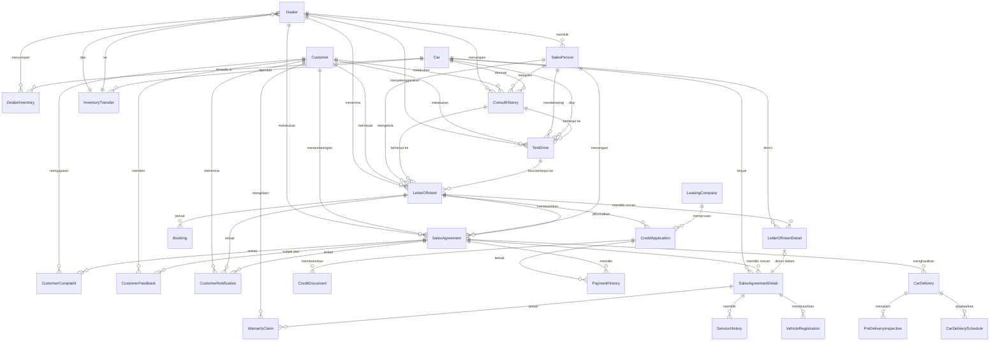

# Final Project: Business Process Modeling for AutoCar Dealership

## 1. Pendahuluan

Repositori ini berisi skema database dan query SQL yang telah direfaktor untuk memodelkan proses bisnis di AutoCar Dealership. Desain ini mencakup seluruh alur penjualan mobil, mulai dari konsultasi awal hingga layanan purna jual, dan dirancang untuk mendukung operasi di berbagai cabang dealer.

## 2. Struktur File

```
.
├── final-project-data.sql
├── final-project-documentation.md
├── final-project-detail.md
├── final-project-schema.sql
├── final-project.pdf
├── Function/
│   ├── fn_CalculateTotalPrice.sql
│   ├── fn_GetDiscountAmount.sql
│   ├── fn_GetFeeAmount.sql
│   └── fn_GetFinalPrice.sql
├── Stored Procedure/
│   ├── sp_ApplyForCredit.sql
│   ├── sp_CreateCarDelivery.sql
│   ├── sp_CreateVehicleRegistration.sql
│   ├── sp_CreateCustomerComplaint.sql
│   ├── sp_CreatePaymentHistory.sql
│   ├── sp_CreateWarrantyClaim.sql
│   ├── sp_RegisterCustomer.sql
│   └── sp_TransferInventoryWithCheck.sql
├── Trigger/
│   ├── trg_UpdatePaymentStatus.sql
│   └── trg_UpdateStockAfterSale.sql
└── View/
    ├── vw_AvailableCars.sql
    ├── vw_CarStock.sql
    ├── vw_CreditStatus.sql
    ├── vw_PaymentStatus.sql
    ├── vw_SalesReport.sql
    └── vw_WarrantyClaimStatus.sql
```

## 2a. Ringkasan Pemetaan Proses Bisnis ke Entitas/Tabel

| Proses Bisnis                | Entitas/Tabel Utama         | Makna/Deskripsi Singkat                                                                 |
|------------------------------|-----------------------------|----------------------------------------------------------------------------------------|
| Konsultasi Awal              | ConsultHistory, Dealer, Customer, SalesPerson, Car | Data konsultasi awal, dealer, pelanggan, petugas penjualan, dan mobil yang diminati |
| Test Drive                   | TestDrive                   | Catatan test drive                                                                      |
| Kesepakatan & Booking Fee    | Booking, LetterOfIntent, LetterOfIntentDetail | Pencatatan booking fee, dokumen LOI (header), dan detail unit mobil di LOI             |
| Proses Kredit                | CreditApplication, LeasingCompany, CreditDocument | Pengajuan kredit, data leasing, dan dokumen pendukung                          |
| Pembayaran & Administrasi    | PaymentHistory, VehicleRegistration, SalesAgreement, SalesAgreementDetail | Pembayaran DP/lunas, administrasi, transaksi penjualan, dan detail mobil yang dibeli   |
| Serah Terima Mobil           | CarDelivery, PreDeliveryInspection, SalesAgreement, SalesAgreementDetail, CarDeliverySchedule | Proses PDI, serah terima mobil, penjadwalan pengiriman, transaksi, dan detail mobil    |
| Pasca-Penjualan              | ServiceHistory, CustomerComplaint, WarrantyClaim, CustomerFeedback, SalesAgreement | Layanan follow-up servis pertama, penanganan keluhan, klaim garansi, feedback pelanggan, dan transaksi |
| Manajemen Stok & Mutasi      | DealerInventory, InventoryTransfer, Dealer, Car | Pengelolaan stok mobil dan mutasi antar dealer                                          |
| Notifikasi Pelanggan         | CustomerNotification        | Notifikasi yang dikirimkan kepada pelanggan terkait transaksi atau status tertentu    |

## 3. Deskripsi File Utama

### [`final-project-schema.sql`](final-project-schema.sql)
File ini berisi seluruh skrip SQL untuk:
- Membuat database `FinalProject`.
- Membuat semua tabel yang diperlukan, lengkap dengan kolom, tipe data, dan constraint.
- Mendefinisikan relasi antar tabel menggunakan foreign key.

### Stored Procedures, Functions, Views, Triggers
Objek database seperti stored procedure, function, view, dan trigger dikelompokkan dalam folder masing-masing untuk kemudahan pengelolaan. Berikut adalah daftar file yang ada:

- **Function:**
  - [`fn_CalculateTotalPrice.sql`](Function/fn_CalculateTotalPrice.sql)
  - [`fn_GetDiscountAmount.sql`](Function/fn_GetDiscountAmount.sql)
  - [`fn_GetFeeAmount.sql`](Function/fn_GetFeeAmount.sql)
  - [`fn_GetFinalPrice.sql`](Function/fn_GetFinalPrice.sql)
  - [`fn_CheckTransferFeasibility.sql`](Function/fn_CheckTransferFeasibility.sql)
- **Stored Procedure:**
  - [`sp_ApplyForCredit.sql`](Stored%20Procedure/sp_ApplyForCredit.sql)
  - [`sp_CreateCarDelivery.sql`](Stored%20Procedure/sp_CreateCarDelivery.sql)
  - [`sp_CreateVehicleRegistration.sql`](Stored%20Procedure/sp_CreateVehicleRegistration.sql)
  - [`sp_CreateCustomerComplaint.sql`](Stored%20Procedure/sp_CreateCustomerComplaint.sql)
  - [`sp_CreatePaymentHistory.sql`](Stored%20Procedure/sp_CreatePaymentHistory.sql)
  - [`sp_CreateWarrantyClaim.sql`](Stored%20Procedure/sp_CreateWarrantyClaim.sql)
  - [`sp_RegisterCustomer.sql`](Stored%20Procedure/sp_RegisterCustomer.sql)
  - [`sp_TransferInventoryWithCheck.sql`](Stored%20Procedure/sp_TransferInventoryWithCheck.sql)
- **Trigger:**
  - [`trg_UpdatePaymentStatus.sql`](Trigger/trg_UpdatePaymentStatus.sql)
  - [`trg_UpdateStockAfterSale.sql`](Trigger/trg_UpdateStockAfterSale.sql)
- **View:**
  - [`vw_AvailableCars.sql`](View/vw_AvailableCars.sql)
  - [`vw_CarStock.sql`](View/vw_CarStock.sql)
  - [`vw_CreditStatus.sql`](View/vw_CreditStatus.sql)
  - [`vw_PaymentStatus.sql`](View/vw_PaymentStatus.sql)
  - [`vw_SalesReport.sql`](View/vw_SalesReport.sql)
  - [`vw_WarrantyClaimStatus.sql`](View/vw_WarrantyClaimStatus.sql)

### [`final-project-documentation.md`](final-project-documentation.md)
Dokumentasi ini berisi ringkasan struktur file dan gambaran umum isi repositori. Untuk penjelasan teknis detail, silakan lihat file detail.

### [`final-project-detail.md`](final-project-detail.md)
Dokumentasi ini berisi penjelasan teknis lengkap: detail tabel, kolom, relasi, ERD, serta contoh dan penjelasan setiap objek database (stored procedure, function, view, trigger).

## 4. Desain Database

### Makna Setiap Entitas/Tabel
| No. | Tabel                  | Makna/Deskripsi                                                                 |
|-----|------------------------|---------------------------------------------------------------------------------|
| 1   | LetterOfIntent         | Header dokumen LOI, berisi info umum pemesanan dan pelanggan.                   |
| 2   | LetterOfIntentDetail   | Rincian unit mobil yang dipesan dalam satu LOI.                                 |
| 3   | SalesAgreement         | Catatan transaksi penjualan yang dibuat setelah pembayaran dan administrasi selesai. |
| 4   | SalesAgreementDetail   | Rincian unit mobil yang dibeli dalam satu transaksi.                              |
| 5   | ConsultHistory         | Catatan konsultasi awal: kebutuhan, preferensi, tanggal, dan hasil diskusi.     |
| 6   | Dealer                 | Data dealer AutoCar, lokasi, dan identitas dealer.                              |
| 7   | Customer               | Menyimpan data pelanggan yang melakukan pembelian mobil.                        |
| 8   | SalesPerson            | Data petugas penjualan yang menangani pelanggan.                                |
| 9   | Car                    | Data mobil yang tersedia untuk dijual di setiap dealer.                         |
| 10  | TestDrive              | Catatan aktivitas test drive oleh pelanggan.                                    |
| 11  | Booking                | Data pembayaran booking fee dan status booking.                                 |
| 12  | CreditApplication      | Data pengajuan kredit oleh pelanggan.                                           |
| 13  | LeasingCompany         | Data perusahaan leasing yang bekerja sama.                                      |
| 14  | CreditDocument         | Dokumen pendukung pengajuan kredit (KTP, slip gaji, dll).                       |
| 15  | PaymentHistory         | Catatan pembayaran DP, pelunasan, atau cicilan kredit.                          |
| 16  | VehicleRegistration    | Proses administrasi STNK, BPKB, pajak, asuransi.                                |
| 17  | CarDelivery            | Proses serah terima mobil ke pelanggan.                                         |
| 18  | CarDeliverySchedule    | Penjadwalan pengiriman kendaraan ke pelanggan.                                  |
| 19  | PreDeliveryInspection  | Catatan Pre-Delivery Inspection (PDI) oleh teknisi.                             |
| 20  | ServiceHistory         | Layanan purna jual, seperti follow-up servis pertama.                           |
| 21  | CustomerComplaint      | Catatan keluhan pelanggan terkait produk atau layanan.                          |
| 22  | WarrantyClaim          | Klaim garansi kendaraan oleh pelanggan.                                         |
| 23  | DealerInventory        | Data stok mobil di setiap dealer, termasuk harga, diskon, dan fee per dealer-mobil. Kombinasi (DealerID, CarID) bersifat unik untuk mencegah duplikasi entri stok per dealer-mobil. |
| 24  | InventoryTransfer      | Catatan mutasi (perpindahan) stok antar dealer.                                 |
| 25  | CustomerFeedback       | Feedback atau survey kepuasan pelanggan setelah transaksi.                      |
| 26  | CustomerNotification   | Notifikasi yang dikirimkan kepada pelanggan terkait transaksi atau status tertentu. |

### Diagram Relasi (ERD)



## 5. Catatan Tambahan
- Seluruh file SQL dapat dijalankan di Microsoft SQL Server.
- Untuk detail implementasi kolom, relasi, dan logika bisnis, silakan merujuk ke file [`final-project-schema.sql`](final-project-schema.sql).